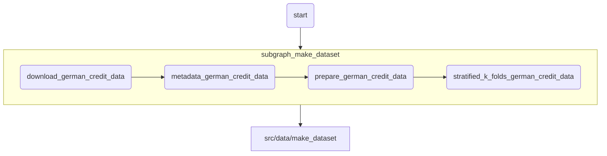

# Project Overview

**Data Flow**

```mermaid
flowchart TB
    S(start) --> subgraph_make_dataset
    subgraph subgraph_make_dataset
        md1(download_german_credit_data)
        md2(metadata_german_credit_data)
        md3(prepare_german_credit_data)
        md4(stratified_k_folds_german_credit_data)
        md1 --> md2 --> md3 --> md4
    end
    subgraph_make_dataset --> A1[src/data/make_dataset] 


    classDef standard fill:#fff,stroke:#000,stroke-width:2px;
    classDef highlight fill:#f0ad4e,stroke:#000,stroke-width:2px;
    class A,G,C,E,F standard;
    class B,D highlight;
```